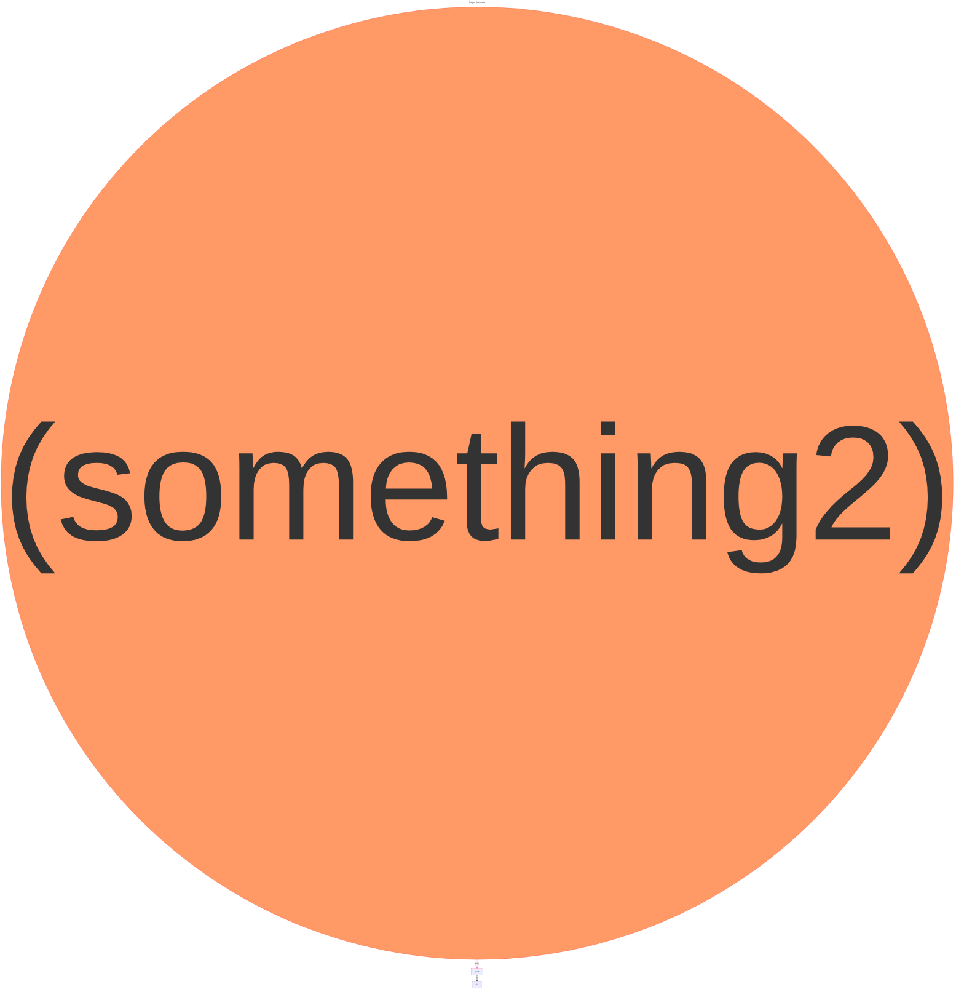

```mermaid
---
title: Regex Automata
---
flowchart TD
    A:::classA
    classDef classA fill:#f96, font-size: 1000pt;
    A:::classB@{ shape: circle, label: "(something2)" }
    classDef classB stroke:#f23
    B:::classB@{ label: "yeah"}
    A 1@-- helo --> B e2@==> C
    1@{animate: true, animation: slow}
    e2@{animate: true, animation: slow}
    %% classDef edgeClass stroke:#023
    %% linkStyle 1 color:blue;
    linkStyle 0 stroke:stroke-width:4px,stroke-dasharray: 3 ;
    linkStyle 0 stroke:#ff00ff
```